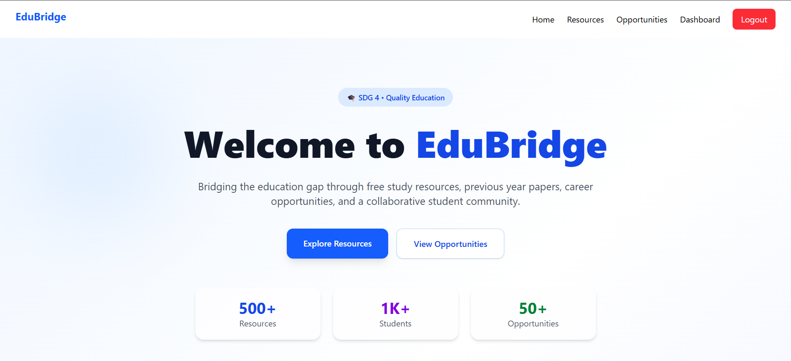
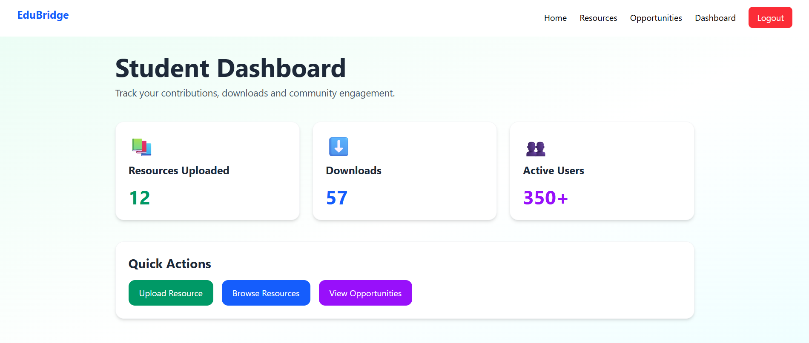
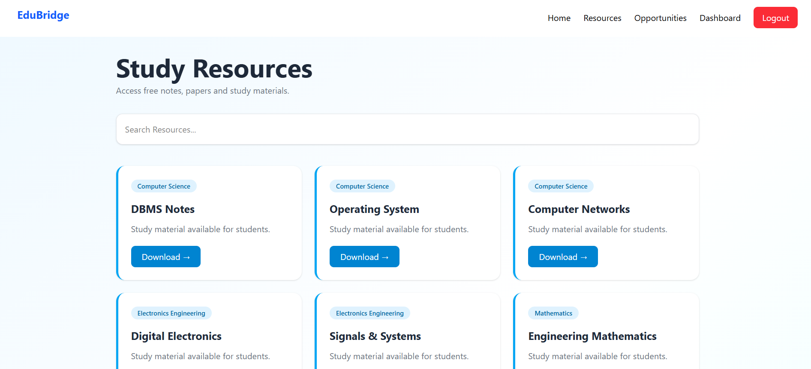
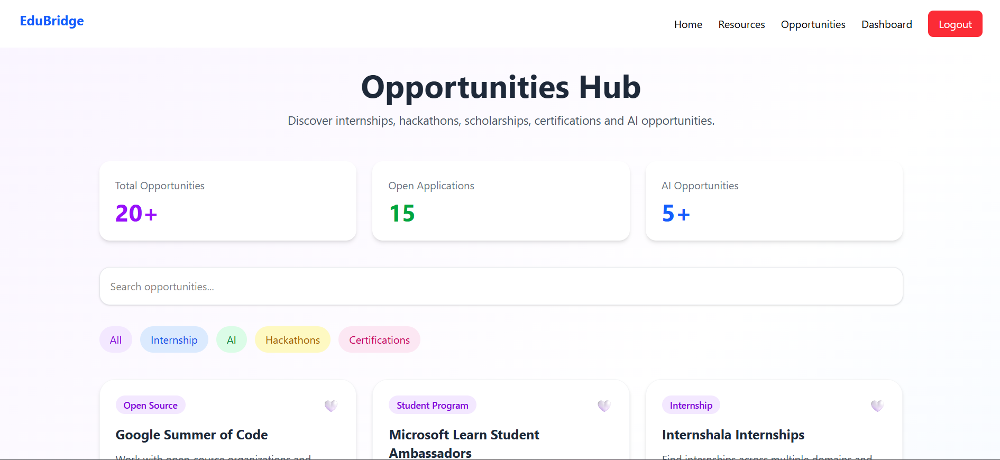
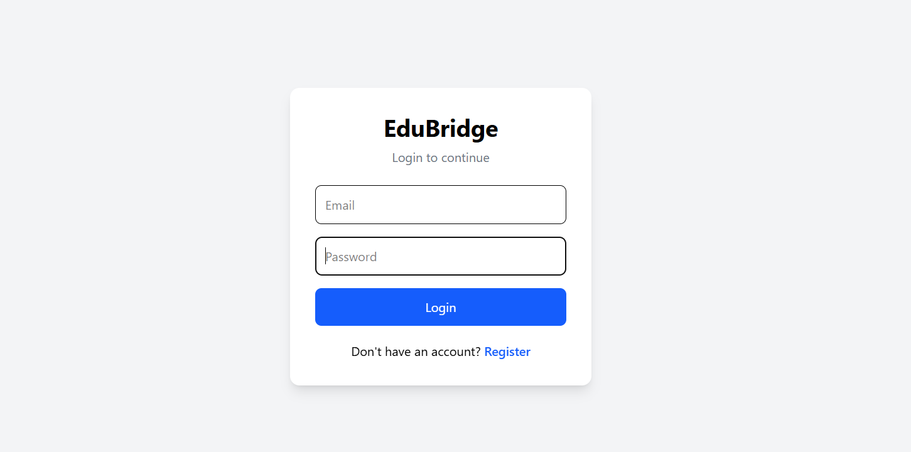
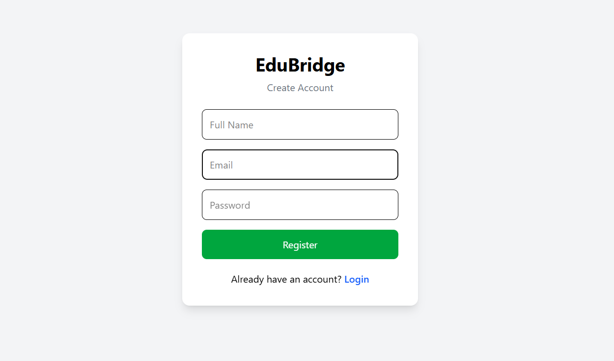

# EduBridge – Smart Learning Resource Platform

> A Full-Stack Educational Platform built to support **United Nations Sustainable Development Goal 4 (Quality Education)** by providing students with free learning resources, career opportunities, and a centralized learning ecosystem.


---

## Overview

EduBridge is a modern full-stack web platform designed to make quality education more accessible for students. It serves as a centralized hub where learners can access study resources, previous year papers, AI learning materials, internships, hackathons, certifications, and much more.

The platform has been developed with scalability, responsiveness, and user experience in mind while aligning with **UN SDG 4 – Quality Education**.

---

## Features

- 🔐 Secure User Authentication
- 📚 Study Resources Repository
- 📄 Previous Year Question Papers
- 🤖 AI & Computer Science Learning Materials
- 💼 Internship Opportunities
- 🏆 Hackathons & Competitions
- 📜 Certification Resources
- 📊 Student Dashboard
- 📱 Fully Responsive UI
- ⚡ Fast API-powered Backend
- 🎯 Modern User Experience

---

## Project Architecture

```
                React + Tailwind CSS
                        │
                        ▼
              FastAPI REST API Backend
                        │
                        ▼
                  PostgreSQL Database
```

---

## Tech Stack

### Frontend

- React.js
- Tailwind CSS
- JavaScript
- HTML5
- CSS3

### Backend

- FastAPI
- Python

### Database

- PostgreSQL

### Tools

- VS Code
- Git
- GitHub

## Installation

### Clone Repository

```bash
git clone https://github.com/YOUR_USERNAME/EduBridge.git
```

### Move to Project

```bash
cd EduBridge
```

---

### Frontend Setup

```bash
cd frontend

npm install

npm run dev
```

---

### Backend Setup

```bash
cd backend

pip install -r requirements.txt

uvicorn app.main:app --reload
```

---

## Running Application

Frontend

```
http://localhost:5173
```

Backend

```
http://127.0.0.1:8000
```

Swagger API Docs

```
http://127.0.0.1:8000/docs
```

---

## Screenshots

> Replace these with actual screenshots.

| Home | Dashboard |
|------|-----------|
|  |  |

| Resources | Opportunities |
|-----------|---------------|
|  |  |

| Login | Register |
|-------|----------|
|  |  |

---

## Use Cases

- College Students
- Engineering Students
- Self Learners
- Competitive Exam Aspirants
- Beginners in AI & Programming

---

## SDG Contribution

This project directly contributes to:

**United Nations Sustainable Development Goal 4**

> Ensure inclusive and equitable quality education and promote lifelong learning opportunities for all.

---

## Future Improvements

- AI Study Assistant
- Personalized Learning Recommendations
- Progress Tracking
- Notes Upload by Community
- Discussion Forum
- Resume Builder
- Placement Preparation Section
- Dark Mode
- Admin Dashboard
- Email Notifications

## Author

**Rishu Parihar**

B.Tech CSE (AI)

---

## Support

If you found this project useful,

⭐ Star this repository

🍴 Fork it

📢 Share it with others

---

## 📄 License

This project is licensed under the MIT License.
